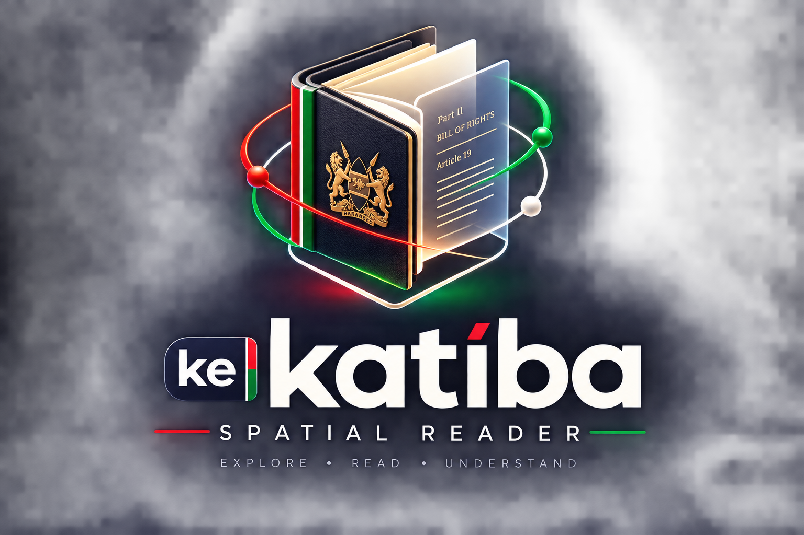

<p align="center">
  
</p>

<h1 align="center">KE Katiba Spatial Reader</h1>

> An interactive 3D reading experience for the **Constitution of Kenya (2010)**, powered by the structured AST emitted by [`ke-katiba-digest`](https://github.com/kibmuikia/ke-katiba-digest).

[](#versioning)
[](https://threejs.org/)
[](https://www.typescriptlang.org/)
[](https://github.com/kibmuikia/ke-katiba-digest)
[](./LICENSE)

---

## Table of contents

- [Table of contents](#table-of-contents)
- [Overview](#overview)
- [Current state](#current-state)
- [Quick start](#quick-start)
- [Project layout](#project-layout)
- [Data integration](#data-integration)
  - [What we pull from upstream](#what-we-pull-from-upstream)
  - [Document shape (as emitted by upstream)](#document-shape-as-emitted-by-upstream)
  - [How it flows at runtime](#how-it-flows-at-runtime)
  - [Refreshing the dataset](#refreshing-the-dataset)
- [Roadmap](#roadmap)
- [Architecture](#architecture)
- [Versioning](#versioning)
- [Acknowledgements](#acknowledgements)

---

## Overview

**Katiba Book 3D** renders the Constitution of Kenya as a clickable, light-reactive volume. Click the book on the canvas and the front cover swings open on its hinge while a synthesised paper-flip sound plays; a slide-over panel reveals the chapter structure. A top-bar pill toggles dark/light themes, and the 3D scene background re-syncs from the active CSS custom properties.

The app is intentionally minimal — a single TypeScript entry, no UI framework — so the entire reading experience can be served as a static bundle and deployed anywhere.

---

## Current state

<!-- BEGIN:CURRENT_STATE -->
| Field | Value |
| --- | --- |
| **Version** | `0.1.0` |
| **Generated** | `2026-08-09` |
| **Stack** | Vite 8 · TypeScript 6 · Three.js 0.185 · sql.js 1.14 |
| **Status** | Pre-alpha · active integration with `ke-katiba-digest` |
<!-- END:CURRENT_STATE -->

**Live dataset shipped in `public/data/`**

| Artifact | Size | Source |
| --- | --- | --- |
| `constitution_kenya_2010.json` | 847 KB | [ke-katiba-digest @ `main`](https://github.com/kibmuikia/ke-katiba-digest/blob/main/output/constitution_kenya_2010.json) |
| `constitution_kenya_2010.db` | 1.0 MB | [ke-katiba-digest @ `main`](https://github.com/kibmuikia/ke-katiba-digest/blob/main/output/constitution_kenya_2010.db) |

**Document coverage**

| Metric | Count |
| --- | --- |
| Title | The Constitution of Kenya, 2010 |
| Country | Kenya |
| Year enacted | 2010 |
| Source attribution | National Council for Law Reporting (Kenya Law) / Katiba Institute |
| Upstream `parsed_at` | `2026-07-27` |
| Chapters | 18 |
| Articles | 227 |

---

## Quick start

```bash
# Requires pnpm. The repo ships with pnpm-lock.yaml.
pnpm install
pnpm dev          # vite dev server with HMR
pnpm build        # tsc --noEmit + vite build → ./dist
pnpm preview      # serve the built bundle locally
pnpm typecheck    # type-check only
```

No backend, no environment variables, no API keys. The dataset is bundled into `public/data/` so the app runs offline once built.

---

## Project layout

```
katiba-book-3d/
├── CLAUDE.md                       # working notes for Claude Code agents
├── README.md                       # this file
├── index.html                      # design tokens + HUD shell + Three.js mount
├── package.json                    # scripts & dependencies
├── pnpm-lock.yaml
├── tsconfig.json                   # bundler mode, verbatim module syntax
├── public/
│   ├── favicon.svg
│   └── data/
│       ├── constitution_kenya_2010.json   # primary structured data
│       └── constitution_kenya_2010.db     # SQLite mirror (lazy-loaded)
├── src/
│   ├── data.ts                     # fetch + cache + lazy sql.js loader
│   ├── sql.js.d.ts                 # ambient types for sql.js (no upstream)
│   ├── main.ts                     # 3D scene, interaction, theme toggle
│   ├── background.ts               # abstract Kenya motion crest background
│   ├── pageTexture.ts              # dynamic canvas page textures
│   └── style.css                   # unused Vite scaffold (kept for reference)
└── data/                           # scratch screenshots & local logs (gitignored)
```

---

## Data integration

This project consumes the parsed AST emitted by [`kibmuikia/ke-katiba-digest`](https://github.com/kibmuikia/ke-katiba-digest). The upstream pipeline converts the official Constitution PDF and the *Laws of Kenya* booklet into a `Chapter → Part → Article → Clause → Subclause` hierarchy and serialises it in two formats.

### What we pull from upstream

| Format | Where we use it | Why |
| --- | --- | --- |
| **JSON** (`constitution_kenya_2010.json`) | Primary fast path. Fetched once on boot, cached in module scope, used to render the chapter list in the side panel. | Tree-walkable, zero extra deps, friendly to Vite's bundler. |
| **SQLite** (`constitution_kenya_2010.db`) | Lazy-loaded via `sql.js` (WASM) only when the reader needs relational queries (full-text search, cross-chapter filtering, clause lookup). | Preserves the `chapters / parts / articles / clauses` foreign-key graph from upstream. |

### Document shape (as emitted by upstream)

```jsonc
{
  "metadata": {
    "title": "The Constitution of Kenya, 2010",
    "country": "Kenya",
    "year": 2010,
    "source": "National Council for Law Reporting (Kenya Law) / Katiba Institute",
    "parsed_at": "2026-07-27"
  },
  "preamble": { "text": "...", "paragraphs": ["..."] },
  "chapters": [
    {
      "node_id": "coK2010:ch1",
      "number": 1,
      "title": "SOVEREIGNTY OF THE PEOPLE AND SUPREMACY OF THIS CONSTITUTION",
      "parts": [],
      "articles": [
        {
          "node_id": "coK2010:art1",
          "number": 1,
          "title": "Sovereignty of the people",
          "canonical_ref": "Article 1",
          "clauses": [
            {
              "node_id": "coK2010:art1:cl1",
              "identifier": "1",
              "canonical_ref": "Article 1(1)",
              "text": "...",
              "subclauses": []
            }
          ]
        }
      ]
    }
  ],
  "schedules": []
}
```

### How it flows at runtime

1. `src/data.ts` → `loadConstitution()` fetches `public/data/constitution_kenya_2010.json` once and caches it.
2. `src/main.ts` consumes the typed `ConstitutionDoc`, renders 18 chapter cards into `#chapterList`, and shows per-chapter article counts and approximate word counts.
3. When advanced features ship (see roadmap), `loadConstitutionDb()` lazily initialises `sql.js`, fetches the SQLite mirror, and exposes a thin `query(sql, params)` shim so the rest of the app never touches WASM directly.

### Refreshing the dataset

The artefacts in `public/data/` are checked-in snapshots of the upstream `main` branch. To pull a fresh digest:

```bash
curl -L -o public/data/constitution_kenya_2010.json \
  https://raw.githubusercontent.com/kibmuikia/ke-katiba-digest/main/output/constitution_kenya_2010.json
curl -L -o public/data/constitution_kenya_2010.db \
  https://raw.githubusercontent.com/kibmuikia/ke-katiba-digest/main/output/constitution_kenya_2010.db
```

After refresh, re-run `pnpm typecheck && pnpm build` and bump the version per the [Versioning](#versioning) policy below.

---

## Roadmap

| Milestone | Status | Notes |
| --- | --- | --- |
| 3D book renders with cover texture, idle bob, dark/light theme | ✅ Shipped (0.1.0) | Current state. |
| Cover click opens, plays paper-flip, slides in chapter list from `ke-katiba-digest` JSON | ✅ Shipped (0.1.0) | |
| Real chapter list populated from parsed AST (18 chapters, 227 articles) | ✅ Shipped (0.1.0) | |
| Mobile responsiveness + viewport-adaptive 3D layout | ✅ Shipped (0.1.0) | |
| Glassmorphism chapter HUD, About modal, mobile offset fixes | ✅ Shipped (0.1.0) | |
| Adaptive aspect-ratio camera distance + morph About page | ✅ Shipped (0.1.0) | |
| Abstract Kenya motion crest background (light/dark aware) | ✅ Shipped (0.1.0) | |
| Dynamic canvas page textures + top-down reading zoom | ✅ Shipped (0.1.0) | |
| Per-chapter reader pane with article text rendered inside the open book | 🔜 0.2.0 | Lazy-load on first chapter open. |
| Full-text search across clauses via the SQLite mirror | 🔜 0.3.0 | Will exercise `loadConstitutionDb()`. |
| Bookmark / share-by-canonical-ref (`Article 33(2)(d)` deep links) | 📋 Backlog | |
| Swahili localisation (parallel `katiba-ke` dataset if upstream adds it) | 📋 Backlog | |
| Mobile / touch interaction (drag-to-rotate, tap-to-open) | 📋 Backlog | |

---

## Architecture

`src/main.ts` is the scene orchestrator (organised in seven labeled sections) and delegates texture generation and background motion to sibling modules. The big-picture flow:

- **`bookGroup`** is the root `THREE.Group`. It contains the page block, back cover, spine, and a `frontCoverPivot` whose `rotation.z` is the only animated transform that opens the cover.
- **`src/pageTexture.ts`** paints the per-page canvas textures that animate behind the chapter cards.
- **`src/background.ts`** renders the abstract Kenya motion crest behind the book, re-syncing from CSS custom properties on theme toggle.
- **`PaperAudioEngine`** lazily creates an `AudioContext` on the first user click (browser autoplay policy) and synthesises a lowpass-swept white-noise burst for the page-flip sound.
- **Interaction** — a single `window.click` listener raycasts against `bookGroup.children`. Clicks on `.interactive-element` ancestors (the theme toggle) are filtered out via `event.target.closest()`.
- **Design tokens** — `:root[data-theme="light|dark"]` CSS custom properties in `index.html` are the single source of truth for color. `getThemeColor()` reads them at runtime and the scene background is re-applied on theme toggle.
- **Data layer** — `src/data.ts` owns fetching/caching the Constitution JSON and lazily standing up the SQLite mirror via `sql.js`. `main.ts` never imports `sql.js` directly; it goes through the loader.

For a more detailed tour, see [`CLAUDE.md`](./CLAUDE.md).

---

## Versioning

This project uses a small, opinionated variant of [SemVer](https://semver.org/):

- **Major** (`1.0.0`): reader is feature-complete for an end-user publication of the Constitution.
- **Minor** (`0.x.0`): new reader feature (e.g. article pane, search). Every minor bump must refresh `public/data/` and update the README's *Current state* table.
- **Patch** (`0.0.x`): bug fix, visual polish, dependency bump, dataset refresh only.

The *Generated* field in [Current state](#current-state) is the ISO date when the README was last regenerated. Update it whenever the table changes.

---

## Acknowledgements

- **[kibmuikia/ke-katiba-digest](https://github.com/kibmuikia/ke-katiba-digest)** — for producing the structured AST this app reads. Without it, every chapter card here would still be hand-typed HTML.
- **[Three.js](https://threejs.org/)** — the rendering engine.
- **[sql.js](https://github.com/sql-js/sql.js)** — WebAssembly SQLite, lets us run the upstream relational dataset entirely in the browser.
- **Republic of Kenya** — for the public-domain legal text this project visualises.

---

<p align="center">
  <sub>Built in Nairobi · 🇰🇪</sub>
</p>
